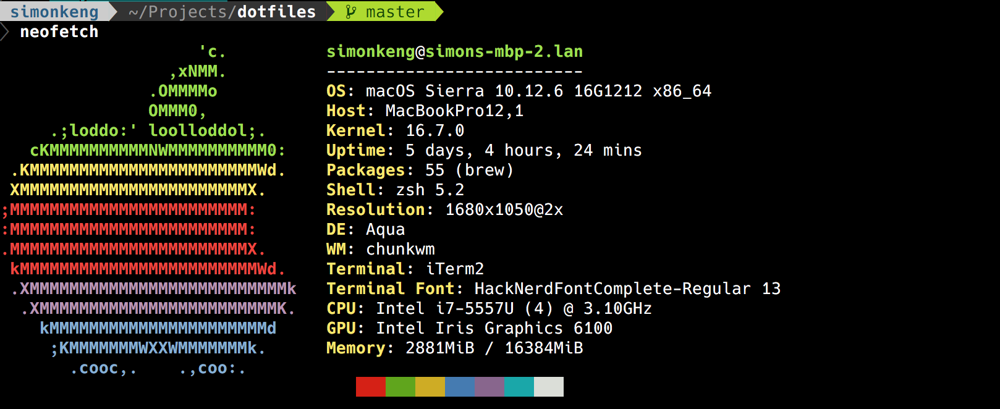

# My Dot Files

With some instructions too.



## chunkwm & skhd

Right now I'm using the [chunkwm](https://koekeishiya.github.io/chunkwm/) window manager with [skhd](https://github.com/koekeishiya/skhd)
hotkey daemon.

For [reference](http://hde-advent-2017.hatenadiary.jp/entry/2017/12/24/000000).

1. Install with Homebrew:

```bash
brew tap crisidev/homebrew-chunkwm
brew install --HEAD --with-tmp-logging chunkwm
brew install --HEAD --with-logging  koekeishiya/formulae/skhd
```
2. Kickoff at login

```bash
brew services start chunkwm
brew services start skbd
```
3. Clone this repo

```bash
git clone https://github.com/simonkeng/dotfiles.git
```
4. Move `.chunkwmrc` and `.skhdrc` to `~`.

5. Allow executable `chmod +x ~/.chunkwmrc`

6. Restart machine to start window manager & hotkey daemon


## vim

I really like [oh my vim](https://github.com/liangxianzhe/oh-my-vim), this is a great modern environment and I use it with two small tweaks, one for highlighting, the other to change the default line numbering. There are many community built configs out there for shells and editors, for vim, this one is my favorite so far. For shells (more below) I'm using oh my fish with bob the fish colorscheme.

1. Install `curl -L https://raw.github.com/liangxianzhe/oh-my-vim/master/tools/install.sh | sh` (you might need to run the [prep script](https://github.com/liangxianzhe/oh-my-vim/blob/master/tools/prepare_mac.sh) first, the command is shown on Oh My Vim's installation instructions)

2. Create `.after.vimrc` file in `~` and add the following lines of code to it:

```bash
set norelativenumber

function! s:ReadCursorLineInfo() "{{{
    highlight CursorLine ctermfg=NONE guifg=NONE
    redir => g:cursorl_hi
    silent exe "hi cursorline"
    redir END

    let g:cursorl_hi = 'highlight' . ' ' . substitute(g:cursorl_hi, '\V\(\n\|\s\*xxx\)', '', 'g')

    if g:cursorl_hi ==? '\V\[\s\n\]\*'
        let g:cursorl_hi = 'highlight CursorLine cterm=NONE ctermbg=235 guibg=White'
    endif
endfunction "}}}

call s:ReadCursorLineInfo()

augroup cursorline
    autocmd!
    autocmd ColorScheme * call s:ReadCursorLineInfo()
    autocmd WinLeave * setlocal nocursorline
    autocmd VimEnter,WinEnter,BufWinEnter * setlocal cursorline
    autocmd InsertEnter * highlight CursorLine term=underline cterm=NONE ctermbg=16  guibg=LightGray
    autocmd InsertLeave * execute g:cursorl_hi
augroup END
```

## fish

The [fish shell](https://fishshell.com/) with [oh my fish](https://github.com/oh-my-fish/oh-my-fish) is currently my favorite shell environment (with several tweaks and altered presets). For fragile workflows, I stick to bash as my go-to, ultra reliable shell. But for pretty much everything else, I love to use fish.

1. Install fish

```bash
brew install fish
```

2. Install oh my fish

```bash
curl -L https://get.oh-my.fish | fish
```

3. Make sure you are in the fish shell by running `fish`, then run:

```bash
omf update
omf install bobthefish
```

4. Install nerd fonts if you haven't already:

```bash
brew tap caskroom/fonts
brew cask install font-hack-nerd-font
```
5. Install powerline status

```bash
pip install powerline-status
```
6. A `.config` file should already exist in your home directory, inside that directory should be `fish`, create `config.fish` file here.

```bash
touch ~/.config/fish/config.fish
```
7. Edit `config.fish` and add the following lines of code:

```.fish
set -g theme_display_git yes
set -g theme_display_git_dirty yes
set -g theme_display_git_untracked yes
set -g theme_display_git_ahead_verbose yes
set -g theme_display_git_dirty_verbose yes
set -g theme_display_git_master_branch yes
set -g theme_git_worktree_support yes
set -g theme_display_vagrant yes
set -g theme_display_docker_machine yes
set -g theme_display_k8s_context yes
set -g theme_display_hg yes
set -g theme_display_virtualenv yes
set -g theme_display_ruby no
set -g theme_display_user ssh
set -g theme_display_hostname ssh
set -g theme_display_vi no
set -g theme_display_date no
set -g theme_display_cmd_duration yes
set -g theme_title_display_process yes
set -g theme_title_display_path no
set -g theme_title_display_user yes
set -g theme_title_use_abbreviated_path no
set -g theme_date_format "+%a %H:%M"
set -g theme_avoid_ambiguous_glyphs yes
set -g theme_powerline_fonts yes
set -g theme_nerd_fonts yes
set -g theme_show_exit_status yes
set -g default_user your_normal_user
set -g theme_color_scheme dark
set -g fish_prompt_pwd_dir_length 0
set -g theme_project_dir_length 1
set -g theme_newline_cursor yes
source /Users/simonkeng/anaconda2/etc/fish/conf.d/conda.fish

```
**Note:** the last line enables activating anaconda virtual environments from within the fish shell. Instead of running `source activate <env_name>` like you would in bash or zsh, you run `conda activate <env_name>` within fish.
